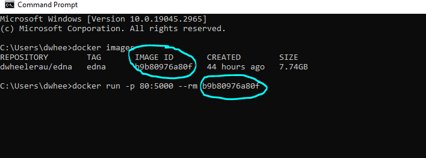
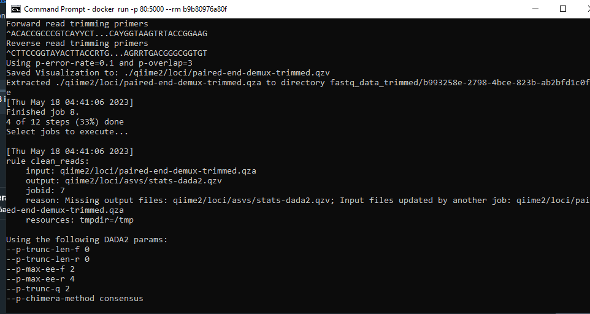

# eDNA-contained

## Introduction
A Docker image containing a eDNA/amplicon pipeline based on
[QIIME2](https://qiime2.org/). The pipeline is controlled via flask GUI that runs
in the users browser.   

**The advantages of the pipeline are:**  
- simple to setup and run using point and click with a browser based GUI
- should run on any machine where [Docker-desktop](https://www.docker.com/products/docker-desktop/) can be installed
- adaptable to any primer combination or taxonomic database
- snakemake is used to confirm successful completion of each stage of the pipeline
- species summary tables with counts are created, including the ASV sequence for manual confirmation of the taxonomic classification
- rarefaction and taxonomic barplots are generated that can be viewed using the [QIIME viewer](https://view.qiime2.org/) (drag and drop)
- A PDF report is generated containing QC plots and important information about the ASV generation so that QC parameters can be optimised 

The pipeline can also be used without Docker as described at this [repo](https://bitbucket.org/dpi_data_analytics/snakemake-qiime-edna/src/master/).  

## Running the image in a container on Windows
Ensure that the Docker-desktop app is installed on your windows computer. A 
complete guide for installing and running Docker images in general can be found
at [here](https://github.com/dwheelerau/docker-guide).  

1. Start by opening the Docker-desktop app (this needs to be running for the following to work).  
2. Open the "command prompt" using the windows start menu
3. Type the following in the terminal window to obtain a copy of the image.  
```
docker pull dwheelerau/edna:edna
```
Downloading the image (~7GB) will take some time depending on your internet connnection.

4. The image should appear in your Docker desktop app under the 'images' section (see screen shot below). 
Click the copy icon next to the iamge id code as shown below (this code will be used in the next command). 

.

5. Type the following command in the terminal window replacing "IMAGEID"
with the code you copied above (you can "paste" by right clicking on the command prompt window boarder
and selecting edit->paste).
```
docker run -p 80:5000 --rm IMAGEID
```


6. Open a internet browser (we recommend chrome or firebox) and enter the following IP address  
```
http://127.0.0.1:80
```
The following window should open (after a short wait for the app to start). Any errors during 
the run should appear in the command prompt window.


7. Select the folder where the fastq.gz sequencing files for this project are located and accept the image upload dialogue.


8. Click 'process folder' button and update the settings on the next page as required (the default if the telo fish eDNA primers)
9. When you are ready use the 'Run pipeline!' button to run the application on your data (the progress will be logged to the command prompt terminal window).


11. A running screen will be replaced by a 'project' with a download link to the results. Any errors will be reported in the command prompt window.
 

## Running the image in a container on Linux
1. Make sure you have Docker installed on your OS
2. Pull the image from a terminal window
```
docker pull dwheelerau/edna:edna
```
3. Find out the image ID using
```
docker images
```
4. Run the image replacing IMAGEID with the number in the first column from the above command.
```
docker run -p 80:5000 --rm IMAGEID
```
5. Open a firefox/chrome browser window and naviate to the following IP address  (or localhost on port 80):
```
http://127.0.0.1:80
```
The app should open in the browser after a short delay. Any errors during pipeline running 
should appear in the terminal window.

6. Follow the instructions from step 7 in the windows section above.

## Building the latest version of the pipeline
Quick start after cloning this repository:
```
cd edna-contained
sudo docker build -f Dockerfile . -t dwheelerau/edna:edna
```
